# Beginner Javascript for NICAR 2020

This is the first class in a series: How to use Javascript to design web visualizations and interactives. In Part One, you'll get an introduction to Javascript and learn how it works on the back-end, with a little bit of designing for front-end. 

This class will go a lot easier if you already know a little HTML and a little CSS. If you are looking for a through tutorial and reference guide, I highly recommend [W3Schools](https://www.w3schools.com/), which starts with HTML and works through Javascript and its plugins. Some other great places to learn more: CodeAcademy, StackExchange, [/r/learnjavascript](https://www.reddit.com/r/learnjavascript/), and Google! I often use Google to reference syntax I've forgotten or brainstorm an error.

I'm typing up this tutorial and code in [Sublime Text](https://www.sublimetext.com/3), a word processing software that makes your code look prettier. But you can still open most script files in TextEdit or get another code viewer like Atom. Another good option is [Glitch](https://glitch.com/), a browser-based platform that lets you view your code on one side and your results on the other.

### Why Javascript

Think of it like this: HTML is the **bones** of a website, describing where everything needs to go and creating structure. CSS is the **skin** of a website, dictating its appearance.

Javascript is the **heart**: It keeps everything moving and decides what action a site is going to take. It responds to what your user does and can pull from multiple places on a website.

### Designing in your browser: Developer tools and your console

This tutorial folder contains several documents: An index.html file, a script.js file, and a style.css file. Double click on index.html and it should open in your default browser. It'll look like this:

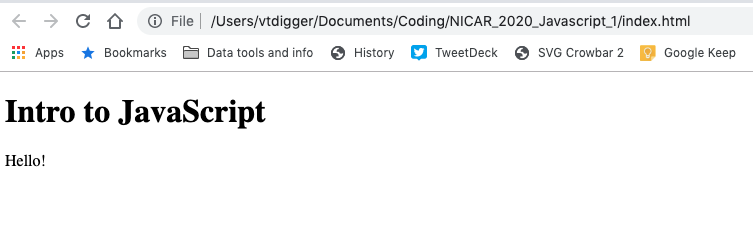

Not much there. But wait. There's a hidden way to see what Javascript is doing on this webpage. To see it, you need to access Developer Tools:

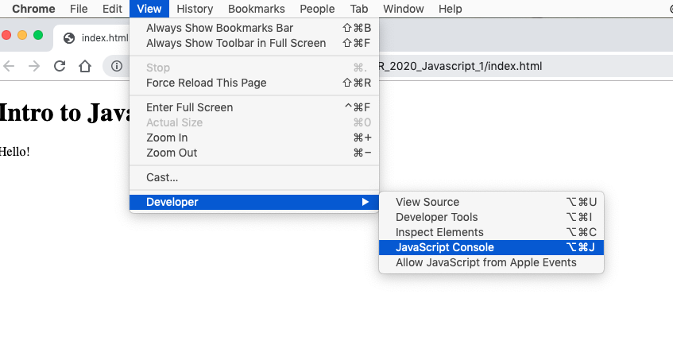

Something like this will appear:

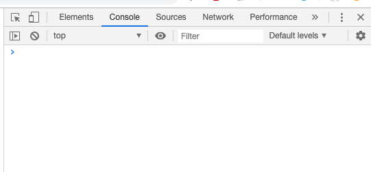

We can use this to write some Javascript! Type the following, character-by-character, into that space next to your cursor: 

`console.log("hello!")`

You should see something like this:

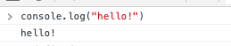

By typing `console.log()`, you're talking directly to the Javascript, asking it to repeat what you tell it to. It's a good way to check whether your code understands you — is it printing what you ask it to print?

You can also change your Javascript by making changes to script.js. Open up that file and type in `console.log("Whatever message you like")`

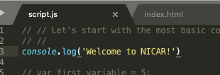

Save that file, then refresh your browser. You should see your message pop up:

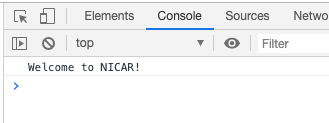

Great! One last note: Another basic thing you won't see appear in the front-end is comments. You can leave a message to yourself like this:

```javascript
// A basic comment
```
And it won't appear in your code otherwise. It's just a way to remind yourself what different parts are doing and take notes. 

### Variables and arrays

One important element of Javascript and many coding languages is a **variable**. A variable can a lot of things: A number, a string of text, or a collection of numbers or text. It's like a bucket: You can toss in whatever you like, and it won't make any difference to the bucket. Then when you need that thing you can pull it out again.

Let's set our first variable:

```javascript
var first_variable = 5;

console.log(first_variable)
```

Refresh your webpage and you'll see that your code remembered what `first_variable` meant.

Here are some more examples of variables:

```javascript
//A text-based variable is always contained in "double" or 'single' quotes.
var string_variable = "Testing!"

console.log(string_variable)

// An array holds multiple numbers or strings.
var array_variable = [6,15,2,36,420]

// You can log the whole array...
console.log(array_variable)

//Or just one specific element, by using its place in the array.
console.log(array_variable[0])
```

Again, refresh and you'll see how we logged all those variables:

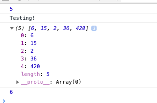

### Loops

A **loop** is a way to tell your code to do something multiple times, or to do something for multiple items. It's pretty essential to data visualization, because usually you have more than one data point -- you want the code to visualize every row in your data.

In Javascript, one way to loop is to use `for`. You start at 0, go to a certain number, and keep iterating through each number.

```javascript

for (i = 0; i < 5; i++) {
  console.log(array_variable[i]);
}

```

Refresh the page and you should see that your code logged every element of your array:

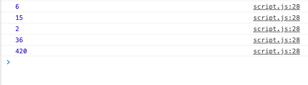

You can also do the same thing with arrays using `forEach`. This time I told it to perform a more specific function -- namely, add 5 to each element:

```javascript
// A function is a way to create a temporary variable that lives just within that function. In this case, element is just a way to refer to each element of the array.
array_variable.forEach(function(element) {
	console.log(element + 5)
	})

```

### Data structures in Javascript

The most fundamental way Javascript reads data is in a **JSON**, which is basically a nested array that contains its own columns. Here's one JSON, where each new bracket is a single row of data:

```javascript
var pets = [
	{
		"Name": "Princess Mia",
		"Type": "cat",
		"Age": 3,
		"Color": "orange",
	},
	{
		"Name": "Willy",
		"Type": "cat",
		"Age": 6,
		"Color": "grey",
	},
	{
		"Name": "Sophie",
		"Type": "dog",
		"Age": 4,
		"Color": "brown",
	},
]
```

You can loop through each row the same way you loop through an array.

```javascript
for (i = 0; i < 3; i++) {
  console.log(pets[i]);
}
```

If you add that to your code, your console will print something like this:

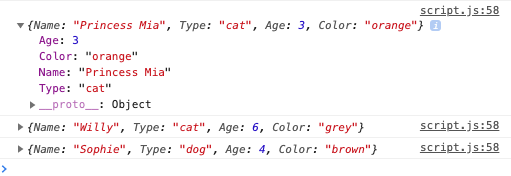

To pull a single data point, you can reference it with its column name. You can do that once, or loop through the whole thing!

```javascript
console.log(pets[0]['Name'] + "- testing")

pets.forEach(function(obj){
	console.log(obj['Name'])
})
```

You'll see the name of each pet appear:

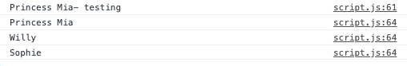

### Interacting with HTML

Ok, maybe you're getting a little sick of adding more numbers to the console. You're right, we haven't actually put anything in the HTML, yet. Let's change that.

Add a line to your code and refresh:

```javascript
// This gets an HTML element with the id "hello" and edits the HTML text - 
document.getElementById('hello').innerHTML = 'Your first front-end Javascript!';
```
You'll get something like this:

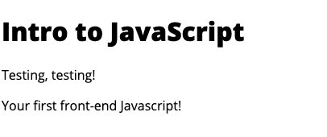

This Javascript works by accessing the **DOM**, AKA the Document Object Model, the underlying structure of HTML. You tell it the element you want and edit it with Javascript.

You can also create new elements: 

```javascript
var new_element = document.createElement('button')
new_element.innerHTML = "Let's create a button!"
document.getElementById('create-button').appendChild(new_element)
```

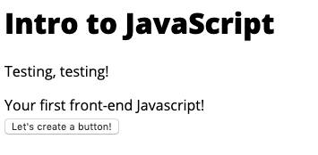

...But the button doesn't do anything yet. You have to tell it to do something when the reader clicks. To do that, you tell it `onclick`, to run a **function** -- something you set at the beginning that performs an action when it's triggered.


```javascript
// This time, we add an "onclick" method that will trigger a function
new_element.innerHTML = "<button onclick='myFunction()'>Click me</button>"


// Here, we create a function that will perform the action:

function myFunction() {
	document.getElementById("button-trigger").innerHTML = "You clicked the button!";

}
```

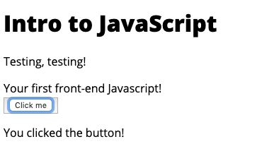

We can do even fancier things by combining functions and loops. Here's one that will show our data when a user clicks the button.

```javascript
new_element.innerHTML = "<button onclick='showNames()'>Click me</button>"

//create a function
function showNames() {
	//loop through our array
	pets.forEach(function(obj){
		//for each element of the array, create a new div
		var pet_row = document.createElement('div')
		// set the value of that new div to the pet's name
		pet_row.innerHTML = obj['Name']
		//append that div to the HTML
		document.getElementById('button-trigger').appendChild(pet_row)
	})
}
```
Here's the result:

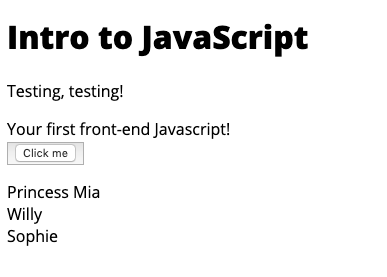

### If/else statements

Another basic component of Javascript is the ability to test whether something is true. An **if/else** statement checks whether a statement is **True** or **False**, then runs code based on that premise.

Here's a basic example:

```javascript
if (6<7) {
	console.log("Why is 6 afraid of 7? Because 7 8 9")
}
```
It's true that 6 is less than 7, so the code in the bracket runs. Otherwise, it can use an `else` or `else if` (else, if) action:

```javascript
if(6>7) {
	console.log('Why is 6 afraid of 7? Because 7 8 9')
} else if (6==7) {
	console.log('6 is fighting for equality')
} else {
	console.log('6 is fighting back')
}
```
In a more elaborate scenario, we can test our data and take action based on it.

```javascript
new_element.innerHTML = "<button onclick='testPets()'>Click me</button>"

//create a function
function testPets() {
	//loop through our array
	pets.forEach(function(obj){
		//for each element of the array, create a new div
		var pet_row = document.createElement('div')
		// test the type of pet
		if (obj['Type'] == 'cat') {
			pet_row.innerHTML = obj['Name'] + ' is a cat'
		} else {
			pet_row.innerHTML = obj['Name'] + ' is a dog'
		}
		
		//append that div to the HTML
		document.getElementById('button-trigger').appendChild(pet_row)
	})
}
```
The result:

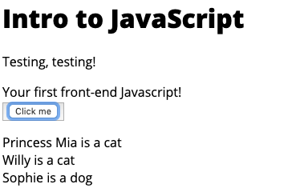

### A quick rundown on plugins

When you're coding in Javascript, you don't need to just run the code itself. You can add plug-ins -- extensions of the code others have created -- to add new features or just save yourself extra coding. 

One example is JQuery, a library that makes it easier to grab elements and add interactivity to them. If you add this line **in your HTML**:

```javascript
<script src='https://code.jquery.com/jquery-3.4.1.min.js'></script>
```

You can re-write that earlier, simple button click like this:

```javascript
new_element.innerHTML = "<button id='jquery-button'>Click me</button>"

$('#jquery-button').click(function(d) {
		document.getElementById("button-trigger").innerHTML = "You clicked a jquery button!";
})
```

The result:

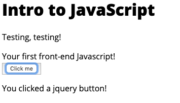

Other helpful packages for dataviz include:

- **Datatables**: Create interactive tables in your browser.
- **Leaflet**: Create free maps with this age-old tool.
- **D3**: Create data visualizations from scratch on the web.